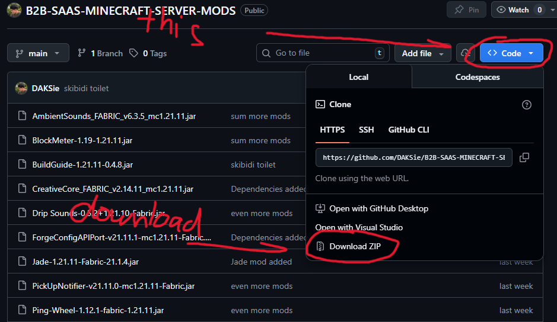

# B2B SAAS Minecraft Server Mods

Personal mods setup for the B2B SAAS Minecraft Server.

## Prerequisites

> **Note:** You must have fabric installed in your minecraft launcher in order to proceed

### Fabric Installation Tutorials
- [Fabric for TLauncher](https://www.youtube.com/watch?v=CJ69o50qdKo&t=8s&pp=ygUiaG93IHRvIGluc3RhbGwgZmFicmljIGluIHRsYXVuY2hlcg%3D%3D)
- [Fabric for Legacy Launcher](https://www.youtube.com/watch?v=0l1XEEaPn6s&pp=ygUoaG93IHRvIGluc3RhbGwgZmFicmljIGluIGxlZ2FjeSBsYXVuY2hlcg%3D%3D)
- [Fabric for the Official Launcher](https://www.youtube.com/watch?v=RpN94a2q8JI&t=1s&pp=ygUfaG93IHRvIGluc3RhbGwgZmFicmljIG1pbmVjcmFmdA%3D%3D)

## Installation Instructions

Follow these steps to install the mods:

### Step 1: Download this repository

### Setep 2: Transfer Files
After downloading open the ZIP file then copy everything inside excluding the `howtodoanload.png` file because that is an image not a mod lol.

After copying paste it inside the mods folder, which is usually located in `C:\Users\[user]]\AppData\Roaming\.minecraft\mods` accesible by pressing `windows + r` and entering "appdata"

### Step 3: Open Minecraft
You should be ready to go after transferring the files.